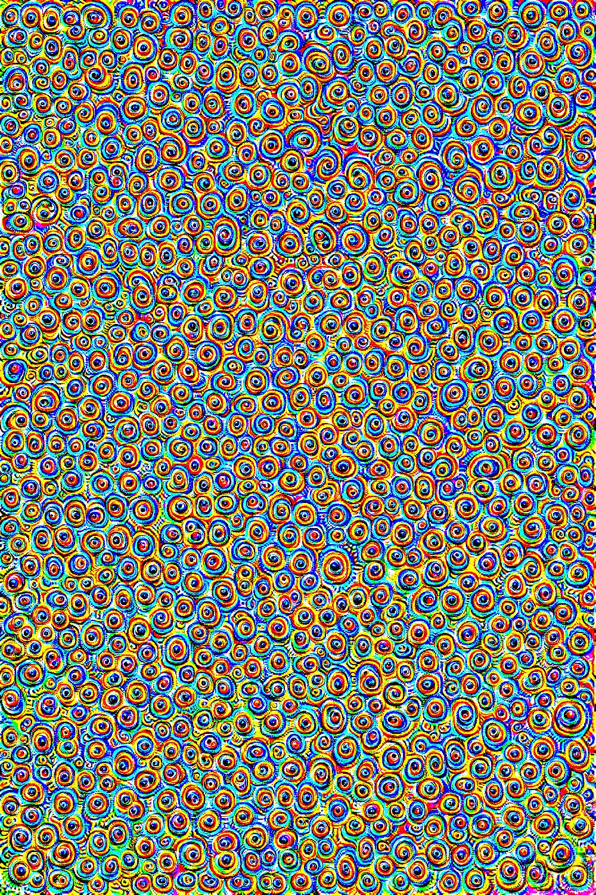
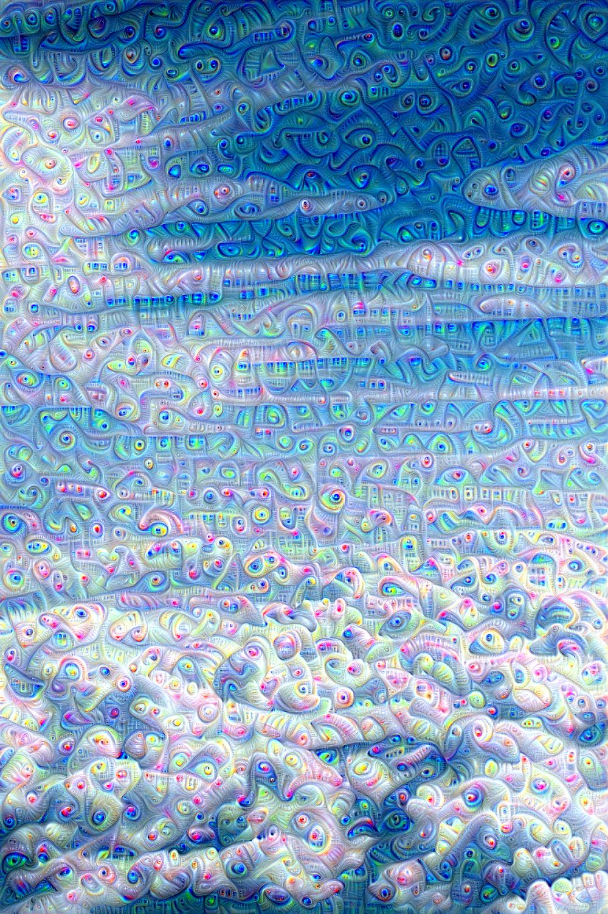

# DeepDream-in-PyTorch

Repeated gradient loss, layer 17       |  Single iter. gradient loss, layer 17
:-------------------------------------:|:-------------------------------------:
    |  


Run on Python 3.8 with PyTorch 1.9.0 and CUDA 11.1 (with cuDNN 8)

### Installation via pip
Install requirements inside your virtual environment as such
```bash
pip3 install -r requirements.txt
```

## Run

Can be run from command line as such:
```bash
python3 train.py path/to/image.file
```
Or on a white-noise image (with dimensions from config) as such
```bash
python3 train.py none
```

With optional arguments. Firstly, `-r N` where N is the number of repeats, and secondly, `-s` if a single FC-layer neuron should be selected at a time, defaults to a random value when provided, but can be set to an integer value. If forward-passing to the classification layer, a class from labels.txt can be selected by index.
More can be found in
```bash
python3 train.py --help
```
